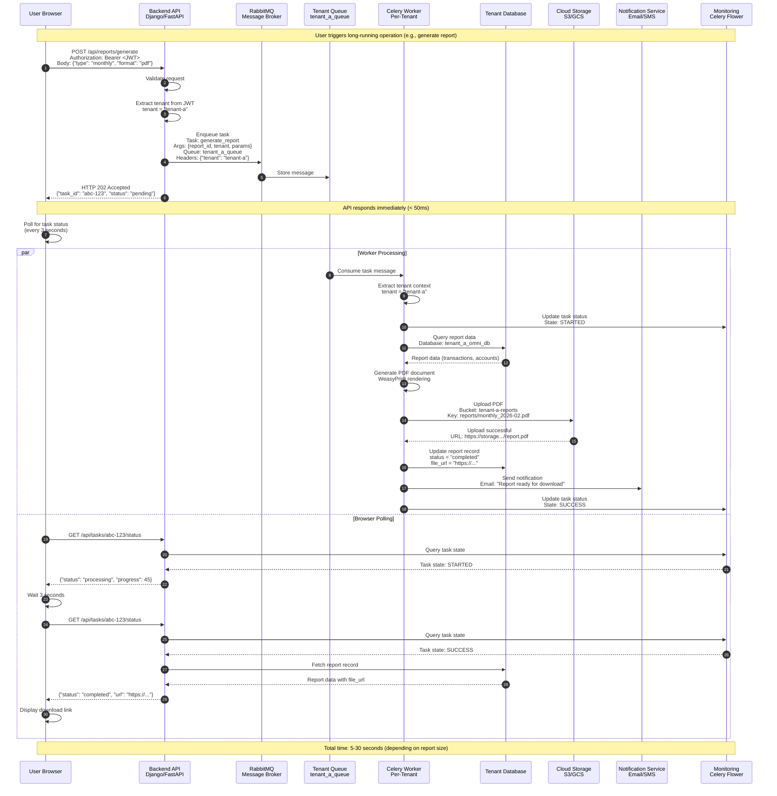
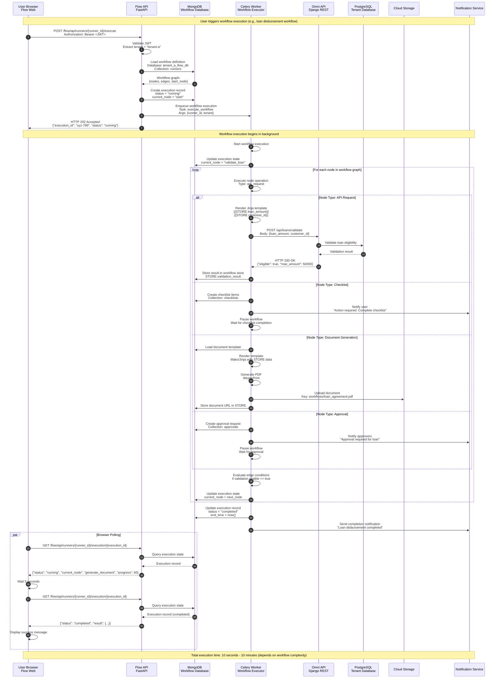
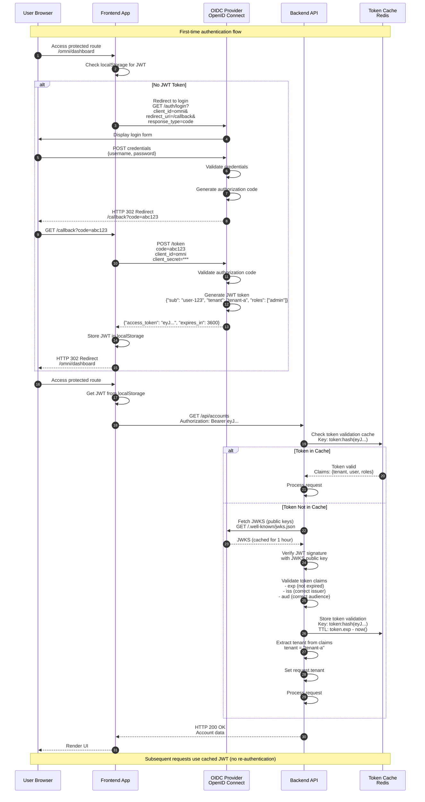

# Request Flow Diagram

**Last Updated**: 2026-02-04
**Version**: 1.0
**Status**: Current

---

## Purpose

This diagram traces end-to-end request flows through the Crego platform, from client browser to database and back. It demonstrates three critical flow patterns: synchronous API requests, asynchronous background tasks, and workflow execution. Each flow includes authentication, tenant resolution, and error handling.

---

## Target Audience

- **Developers**: Understanding API request patterns and integration points
- **QA Engineers**: Designing test scenarios and debugging issues
- **Performance Engineers**: Identifying bottlenecks and optimization opportunities
- **Support Teams**: Troubleshooting production issues and errors
- **Integration Partners**: Building external systems that call Crego APIs

---

## Flow 1: Synchronous API Request

```
┌─────────────────────────────────────────────────────────────────────────────┐
│                      SYNCHRONOUS API REQUEST FLOW                           │
│                                                                             │
│  Step 1: User Action                                                        │
│  ┌──────────────┐                                                           │
│  │   Browser    │  User clicks "View Accounts"                              │
│  └──────┬───────┘                                                           │
│         │                                                                   │
│         │ HTTPS GET /api/accounts                                           │
│         │ Authorization: Bearer eyJ...                                      │
│         │ Host: tenant-a.crego.com                                          │
│         ▼                                                                   │
│  ┌────────────────┐                                                         │
│  │ Load Balancer  │  Route based on path                                    │
│  │ NGINX/ALB      │                                                         │
│  └────────┬───────┘                                                         │
│           ▼                                                                 │
│  Step 2: Authentication & Tenant Resolution                                 │
│  ┌──────────────────────────────────────────────────────────┐               │
│  │  Backend API (Django/FastAPI)                            │               │
│  │                                                          │               │
│  │  ┌───────────────────────────────────────────────────┐  │               │
│  │  │  TenantMiddleware                                 │  │               │
│  │  │  • Validate JWT Token                             │  │               │
│  │  │  • Extract tenant from JWT claims                 │  │               │
│  │  │  • tenant = "tenant-a"                            │  │               │
│  │  │  • Set request.tenant                             │  │               │
│  │  └───────────────────────────────────────────────────┘  │               │
│  └──────────────────────────────────────────────────────────┘               │
│           │                                                                 │
│           │                                                                 │
│           ▼                                                                 │
│  Step 3: Cache Check                                                        │
│  ┌──────────────────────────────────────────────────────────┐               │
│  │  Redis Cache                                             │               │
│  │  Key: tenant:tenant-a:accounts:list                      │               │
│  └──────────────────────────────────────────────────────────┘               │
│           │                                                                 │
│           ├─────────────┬────────────────┐                                  │
│           │  Cache Hit  │  Cache Miss    │                                  │
│           ▼             ▼                                                   │
│  ┌─────────────┐  ┌─────────────────────────────────────┐                  │
│  │ Return      │  │  Step 4: Database Query              │                  │
│  │ Cached Data │  │  ┌───────────────────────────────┐  │                  │
│  │ (50-150ms)  │  │  │ TenantDatabaseRouter          │  │                  │
│  └──────┬──────┘  │  │ • Resolve DB alias            │  │                  │
│         │         │  │ • tenant-a → tenant_a_omni_db │  │                  │
│         │         │  └───────────────────────────────┘  │                  │
│         │         │           │                          │                  │
│         │         │           ▼                          │                  │
│         │         │  ┌───────────────────────────────┐  │                  │
│         │         │  │ PostgreSQL                    │  │                  │
│         │         │  │ Database: tenant_a_omni_db    │  │                  │
│         │         │  │ SELECT * FROM accounts...     │  │                  │
│         │         │  └───────────────────────────────┘  │                  │
│         │         │           │                          │                  │
│         │         │           │ Query Results            │                  │
│         │         │           ▼                          │                  │
│         │         │  Step 5: Store in Cache              │                  │
│         │         │  ┌───────────────────────────────┐  │                  │
│         │         │  │ Redis SET                     │  │                  │
│         │         │  │ Key: tenant:tenant-a:accounts │  │                  │
│         │         │  │ TTL: 3600s (1 hour)           │  │                  │
│         │         │  └───────────────────────────────┘  │                  │
│         │         │           │ (150-500ms)              │                  │
│         │         └───────────┼──────────────────────────┘                  │
│         │                     │                                             │
│         └─────────────────────┘                                             │
│                               │                                             │
│  Step 6: Return Response      ▼                                             │
│  ┌────────────────────────────────────────────────────────┐                 │
│  │  API Response                                          │                 │
│  │  HTTP 200 OK                                           │                 │
│  │  Content-Type: application/json                        │                 │
│  │  {                                                     │                 │
│  │    "accounts": [                                       │                 │
│  │      {"id": "acc-123", "name": "Savings"},             │                 │
│  │      {"id": "acc-456", "name": "Checking"}             │                 │
│  │    ]                                                   │                 │
│  │  }                                                     │                 │
│  └────────────────────────────────────────────────────────┘                 │
│                               │                                             │
│                               ▼                                             │
│  ┌──────────────┐                                                           │
│  │   Browser    │  Render UI with account data                              │
│  └──────────────┘                                                           │
│                                                                             │
│  Total Response Time:                                                       │
│  • Cache Hit:  50-150ms                                                     │
│  • Cache Miss: 150-500ms                                                    │
└─────────────────────────────────────────────────────────────────────────────┘
```

---

## Flow 2: Asynchronous Background Task

```
┌─────────────────────────────────────────────────────────────────────────────┐
│                    ASYNCHRONOUS BACKGROUND TASK FLOW                        │
│                                                                             │
│  Step 1: User Triggers Task                                                 │
│  ┌──────────────┐                                                           │
│  │   Browser    │  POST /api/reports/generate                               │
│  └──────┬───────┘  Body: {"type": "monthly", "format": "pdf"}               │
│         │                                                                   │
│         ▼                                                                   │
│  ┌───────────────────────────────────────────────────────┐                  │
│  │  Backend API                                          │                  │
│  │  • Validate request                                   │                  │
│  │  • Extract tenant from JWT: tenant-a                  │                  │
│  └───────────────────────────────────────────────────────┘                  │
│         │                                                                   │
│         │                                                                   │
│  Step 2: Enqueue Task to RabbitMQ                                           │
│         │                                                                   │
│         ▼                                                                   │
│  ┌───────────────────────────────────────────────────────┐                  │
│  │  RabbitMQ                                             │                  │
│  │  Queue: tenant_a_queue                                │                  │
│  │  Message:                                             │                  │
│  │    Task: generate_report                              │                  │
│  │    Args: {report_id, tenant: "tenant-a", params}      │                  │
│  │    Headers: {"tenant": "tenant-a"}                    │                  │
│  └───────────────────────────────────────────────────────┘                  │
│         │                                                                   │
│  Step 3: Immediate Response (Non-Blocking)                                  │
│         │                                                                   │
│         ▼                                                                   │
│  ┌──────────────┐                                                           │
│  │   Browser    │  HTTP 202 Accepted                                        │
│  └──────────────┘  {"task_id": "abc-123", "status": "pending"}              │
│         │          (Response time: < 50ms)                                  │
│         │                                                                   │
│         │ Browser starts polling for status                                 │
│         │ GET /api/tasks/abc-123/status (every 3 seconds)                   │
│         │                                                                   │
│  ┌───────────────────────────────────────────────────────────────────────┐  │
│  │  WORKER PROCESSING (Parallel)                                         │  │
│  │                                                                        │  │
│  │  Step 4: Worker Consumes Task                                          │  │
│  │  ┌──────────────────────────────────────────────────────┐              │  │
│  │  │  Celery Worker (omni-celery-worker-tenant-a)        │              │  │
│  │  │  • Consume from queue: tenant_a_queue               │              │  │
│  │  │  • Extract tenant: tenant-a                         │              │  │
│  │  │  • Update status: STARTED                           │              │  │
│  │  └──────────────────────────────────────────────────────┘              │  │
│  │         │                                                               │  │
│  │  Step 5: Query Data                                                     │  │
│  │         │                                                               │  │
│  │         ▼                                                               │  │
│  │  ┌──────────────────────────────────────────────────────┐              │  │
│  │  │  PostgreSQL (tenant_a_omni_db)                       │              │  │
│  │  │  SELECT * FROM transactions                          │              │  │
│  │  │  WHERE date >= '2026-01-01'                          │              │  │
│  │  └──────────────────────────────────────────────────────┘              │  │
│  │         │                                                               │  │
│  │  Step 6: Generate PDF                                                   │  │
│  │         │                                                               │  │
│  │         ▼                                                               │  │
│  │  ┌──────────────────────────────────────────────────────┐              │  │
│  │  │  WeasyPrint PDF Generation                           │              │  │
│  │  │  Render report template with data                    │              │  │
│  │  └──────────────────────────────────────────────────────┘              │  │
│  │         │                                                               │  │
│  │  Step 7: Upload to Cloud Storage                                        │  │
│  │         │                                                               │  │
│  │         ▼                                                               │  │
│  │  ┌──────────────────────────────────────────────────────┐              │  │
│  │  │  Cloud Storage (S3/GCS)                              │              │  │
│  │  │  Bucket: tenant-a-reports                            │              │  │
│  │  │  Key: reports/monthly_2026-02.pdf                    │              │  │
│  │  │  URL: https://storage.../report.pdf                  │              │  │
│  │  └──────────────────────────────────────────────────────┘              │  │
│  │         │                                                               │  │
│  │  Step 8: Update Database & Send Notification                            │  │
│  │         │                                                               │  │
│  │         ▼                                                               │  │
│  │  ┌──────────────────────────────────────────────────────┐              │  │
│  │  │  Update report record in DB                          │              │  │
│  │  │  status = "completed"                                │              │  │
│  │  │  file_url = "https://..."                            │              │  │
│  │  │                                                      │              │  │
│  │  │  Send email: "Report ready for download"            │              │  │
│  │  │                                                      │              │  │
│  │  │  Update task status: SUCCESS                         │              │  │
│  │  └──────────────────────────────────────────────────────┘              │  │
│  └────────────────────────────────────────────────────────────────────────┘  │
│                                                                             │
│  Meanwhile, browser continues polling:                                      │
│  ┌──────────────┐                                                           │
│  │   Browser    │  GET /api/tasks/abc-123/status                            │
│  └──────┬───────┘  {"status": "processing", "progress": 45}                 │
│         │                                                                   │
│         │ (3 seconds later)                                                 │
│         │                                                                   │
│         ▼                                                                   │
│  ┌──────────────┐                                                           │
│  │   Browser    │  GET /api/tasks/abc-123/status                            │
│  └──────┬───────┘  {"status": "completed", "url": "https://..."}            │
│         │                                                                   │
│         ▼                                                                   │
│  Display download link to user                                              │
│                                                                             │
│  Total Processing Time: 5-30 seconds (depends on report size)               │
└─────────────────────────────────────────────────────────────────────────────┘
```

---

## Flow 3: Workflow Execution (Flow Engine)

```
┌─────────────────────────────────────────────────────────────────────────────┐
│                        WORKFLOW EXECUTION FLOW                              │
│                                                                             │
│  Step 1: User Triggers Workflow                                             │
│  ┌──────────────┐                                                           │
│  │  Flow Web    │  POST /flow/api/runners/{runner_id}/execute               │
│  └──────┬───────┘  (Loan Disbursement Workflow)                             │
│         │                                                                   │
│         ▼                                                                   │
│  ┌───────────────────────────────────────────────────────┐                  │
│  │  Flow API                                             │                  │
│  │  • Validate JWT, Extract tenant: tenant-a             │                  │
│  └───────────────────────────────────────────────────────┘                  │
│         │                                                                   │
│  Step 2: Load Workflow Definition                                           │
│         │                                                                   │
│         ▼                                                                   │
│  ┌───────────────────────────────────────────────────────┐                  │
│  │  MongoDB (tenant_a_flow_db)                           │                  │
│  │  Collection: runners                                  │                  │
│  │  Load: {                                              │                  │
│  │    nodes: [validate_loan, check_credit, approve],     │                  │
│  │    edges: [{from: validate, to: check_credit}],       │                  │
│  │    start_node: "validate_loan"                        │                  │
│  │  }                                                    │                  │
│  └───────────────────────────────────────────────────────┘                  │
│         │                                                                   │
│  Step 3: Create Execution Record & Enqueue                                  │
│         │                                                                   │
│         ▼                                                                   │
│  ┌───────────────────────────────────────────────────────┐                  │
│  │  MongoDB: Create execution record                     │                  │
│  │  status = "running"                                   │                  │
│  │  current_node = "start"                               │                  │
│  │                                                       │                  │
│  │  Celery: Enqueue workflow execution task              │                  │
│  │  Queue: tenant_a_queue                                │                  │
│  └───────────────────────────────────────────────────────┘                  │
│         │                                                                   │
│         ▼                                                                   │
│  ┌──────────────┐                                                           │
│  │  Flow Web    │  HTTP 202 Accepted                                        │
│  └──────────────┘  {"execution_id": "xyz-789", "status": "running"}         │
│                                                                             │
│  ┌───────────────────────────────────────────────────────────────────────┐  │
│  │  WORKFLOW WORKER PROCESSING (Background)                              │  │
│  │                                                                        │  │
│  │  Step 4: Execute Workflow Nodes (Loop)                                 │  │
│  │  ┌──────────────────────────────────────────────────────┐              │  │
│  │  │  Celery Worker (flow-celery-worker-tenant-a)        │              │  │
│  │  └──────────────────────────────────────────────────────┘              │  │
│  │         │                                                               │  │
│  │  ┌──────▼─────────────────────────────────────────────┐                │  │
│  │  │  NODE 1: validate_loan (API Request)              │                │  │
│  │  │  • Render template: {loan_amount: 50000}          │                │  │
│  │  │  • Call Omni API:                                 │                │  │
│  │  │    POST /api/loans/validate                       │                │  │
│  │  │  • Response: {"eligible": true, "max": 50000}     │                │  │
│  │  │  • Store in STORE.validation_result               │                │  │
│  │  └───────────────────────────────────────────────────┘                │  │
│  │         │                                                               │  │
│  │  ┌──────▼─────────────────────────────────────────────┐                │  │
│  │  │  NODE 2: check_credit (API Request)               │                │  │
│  │  │  • Call external credit bureau API                │                │  │
│  │  │  • Response: {"score": 750}                       │                │  │
│  │  │  • Store in STORE.credit_score                    │                │  │
│  │  └───────────────────────────────────────────────────┘                │  │
│  │         │                                                               │  │
│  │  ┌──────▼─────────────────────────────────────────────┐                │  │
│  │  │  NODE 3: generate_agreement (Document Gen)        │                │  │
│  │  │  • Load template from MongoDB                     │                │  │
│  │  │  • Render with Mako/Jinja: {{STORE.loan_amount}}  │                │  │
│  │  │  • Generate PDF with WeasyPrint                   │                │  │
│  │  │  • Upload to Cloud Storage                        │                │  │
│  │  │  • Store URL in STORE.agreement_url               │                │  │
│  │  └───────────────────────────────────────────────────┘                │  │
│  │         │                                                               │  │
│  │  ┌──────▼─────────────────────────────────────────────┐                │  │
│  │  │  NODE 4: approval (Approval Request)               │                │  │
│  │  │  • Create approval in MongoDB                     │                │  │
│  │  │  • Send notification to approvers                 │                │  │
│  │  │  • PAUSE workflow (wait for approval)             │                │  │
│  │  └───────────────────────────────────────────────────┘                │  │
│  │         │                                                               │  │
│  │         │ ... (Resume after approval) ...                               │  │
│  │         │                                                               │  │
│  │  ┌──────▼─────────────────────────────────────────────┐                │  │
│  │  │  NODE 5: disburse_loan (API Request)              │                │  │
│  │  │  • Call Omni API: POST /api/transactions          │                │  │
│  │  │  • Create disbursement transaction                │                │  │
│  │  │  • Response: {"txn_id": "txn-123"}                │                │  │
│  │  └───────────────────────────────────────────────────┘                │  │
│  │         │                                                               │  │
│  │  Step 5: Complete Workflow                                              │  │
│  │         │                                                               │  │
│  │         ▼                                                               │  │
│  │  ┌──────────────────────────────────────────────────────┐              │  │
│  │  │  MongoDB: Update execution record                    │              │  │
│  │  │  status = "completed"                                │              │  │
│  │  │  end_time = now()                                    │              │  │
│  │  │                                                      │              │  │
│  │  │  Send notification: "Loan disbursement completed"    │              │  │
│  │  └──────────────────────────────────────────────────────┘              │  │
│  └────────────────────────────────────────────────────────────────────────┘  │
│                                                                             │
│  Meanwhile, Flow Web polls for updates:                                     │
│  ┌──────────────┐                                                           │
│  │  Flow Web    │  GET /flow/api/runners/{id}/execution/{exec_id}           │
│  └──────┬───────┘  {"status": "running", "current_node": "check_credit"}    │
│         │                                                                   │
│         ▼                                                                   │
│  (5 seconds later)                                                          │
│  ┌──────────────┐                                                           │
│  │  Flow Web    │  GET /flow/api/runners/{id}/execution/{exec_id}           │
│  └──────┬───────┘  {"status": "completed", "result": {...}}                 │
│         │                                                                   │
│         ▼                                                                   │
│  Display success message                                                    │
│                                                                             │
│  Total Execution Time: 10 seconds - 10 minutes (or days for approvals)      │
└─────────────────────────────────────────────────────────────────────────────┘
```

---

## Authentication Flow Detail

```
┌─────────────────────────────────────────────────────────────────────────────┐
│                         AUTHENTICATION FLOW                                 │
│                                                                             │
│  Step 1: First-Time Login                                                   │
│  ┌──────────────┐                                                           │
│  │   Browser    │  Access: /omni/dashboard (protected route)                │
│  └──────┬───────┘                                                           │
│         │ No JWT token in localStorage                                      │
│         │                                                                   │
│         ▼                                                                   │
│  ┌───────────────────────────────────────────────────────┐                  │
│  │  Frontend App                                         │                  │
│  │  Redirect to OIDC Provider                            │                  │
│  └───────────────────────────────────────────────────────┘                  │
│         │                                                                   │
│         ▼                                                                   │
│  ┌───────────────────────────────────────────────────────┐                  │
│  │  OIDC Provider                                        │                  │
│  │  GET /auth/login?                                     │                  │
│  │    client_id=omni&                                    │                  │
│  │    redirect_uri=/callback&                            │                  │
│  │    response_type=code                                 │                  │
│  └───────────────────────────────────────────────────────┘                  │
│         │                                                                   │
│  Step 2: User Authentication                                                │
│         │                                                                   │
│         ▼                                                                   │
│  ┌──────────────┐                                                           │
│  │   Browser    │  Display login form                                       │
│  └──────┬───────┘                                                           │
│         │ User enters credentials                                           │
│         │                                                                   │
│         ▼                                                                   │
│  ┌───────────────────────────────────────────────────────┐                  │
│  │  OIDC Provider                                        │                  │
│  │  POST credentials                                     │                  │
│  │  • Validate username/password                         │                  │
│  │  • Generate authorization code                        │                  │
│  └───────────────────────────────────────────────────────┘                  │
│         │                                                                   │
│         ▼                                                                   │
│  HTTP 302 Redirect: /callback?code=abc123                                   │
│         │                                                                   │
│  Step 3: Exchange Code for Token                                            │
│         │                                                                   │
│         ▼                                                                   │
│  ┌───────────────────────────────────────────────────────┐                  │
│  │  Frontend App                                         │                  │
│  │  POST /token                                          │                  │
│  │    code=abc123                                        │                  │
│  │    client_id=omni                                     │                  │
│  │    client_secret=***                                  │                  │
│  └───────────────────────────────────────────────────────┘                  │
│         │                                                                   │
│         ▼                                                                   │
│  ┌───────────────────────────────────────────────────────┐                  │
│  │  OIDC Provider                                        │                  │
│  │  Generate JWT Token                                   │                  │
│  │  {                                                    │                  │
│  │    "sub": "user-123",                                 │                  │
│  │    "email": "user@example.com",                       │                  │
│  │    "tenant": "tenant-a",                              │                  │
│  │    "roles": ["admin"],                                │                  │
│  │    "exp": 1735689600                                  │                  │
│  │  }                                                    │                  │
│  │                                                       │                  │
│  │  Response: {"access_token": "eyJ...", "expires_in": 3600}  │             │
│  └───────────────────────────────────────────────────────┘                  │
│         │                                                                   │
│         ▼                                                                   │
│  ┌──────────────┐                                                           │
│  │  Frontend    │  Store JWT in localStorage                                │
│  └──────┬───────┘  Redirect to /omni/dashboard                              │
│         │                                                                   │
│  Step 4: Subsequent Requests (with cached token)                            │
│         │                                                                   │
│         ▼                                                                   │
│  ┌──────────────┐                                                           │
│  │  Frontend    │  GET /api/accounts                                        │
│  └──────┬───────┘  Authorization: Bearer eyJ...                             │
│         │                                                                   │
│         ▼                                                                   │
│  ┌───────────────────────────────────────────────────────┐                  │
│  │  Backend API                                          │                  │
│  │  • Check token validation cache                       │                  │
│  │  • If not cached:                                     │                  │
│  │    - Fetch JWKS from OIDC Provider                    │                  │
│  │    - Verify JWT signature                             │                  │
│  │    - Validate claims (exp, iss, aud)                  │                  │
│  │    - Cache validation result (TTL = token.exp - now)  │                  │
│  │  • Extract tenant from claims                         │                  │
│  │  • Process request                                    │                  │
│  └───────────────────────────────────────────────────────┘                  │
│                                                                             │
│  JWT Token Structure:                                                       │
│  {                                                                          │
│    "header": {"alg": "RS256", "typ": "JWT"},                                │
│    "payload": {                                                             │
│      "sub": "user-123",                                                     │
│      "email": "user@example.com",                                           │
│      "tenant": "tenant-a",                                                  │
│      "roles": ["admin", "user"],                                            │
│      "iss": "https://omni.crego.com",                                       │
│      "aud": "omni",                                                         │
│      "exp": 1735689600,                                                     │
│      "iat": 1735686000                                                      │
│    }                                                                        │
│  }                                                                          │
└─────────────────────────────────────────────────────────────────────────────┘
```

---

### Key Characteristics

**Response Time**:
- **Cache Hit**: 50-150ms
- **Database Query**: 150-500ms
- **Complex Query**: 500-2000ms

**Error Handling**:
- **401 Unauthorized**: JWT token invalid or expired
- **403 Forbidden**: User lacks permission for resource
- **404 Not Found**: Resource doesn't exist
- **500 Internal Server Error**: Database connection failure

**Performance Optimizations**:
- Redis caching for frequently accessed data
- Database connection pooling
- Query result pagination (50-200 items per page)
- Field selection (sparse fieldsets via drf-flex-fields)

---

## Flow 2: Asynchronous Background Task



### Key Characteristics

**Use Cases**:
- Report generation (PDF, Excel)
- Bulk data imports/exports
- Payment processing
- Document generation
- Email notifications
- Data synchronization

**Response Time**:
- **API Response**: < 50ms (immediate acknowledgment)
- **Task Processing**: 5 seconds - 10 minutes (depends on task complexity)
- **Polling Interval**: 3 seconds

**Error Handling**:
- **Task Failure**: Retry up to 3 times with exponential backoff
- **Dead Letter Queue**: Failed tasks moved to `tenant_a_queue_dlq`
- **Alert on Failure**: Notification sent to ops team
- **User Notification**: Error message displayed in UI

**Performance Optimizations**:
- Per-tenant worker deployments (resource isolation)
- KEDA autoscaling (1-20 replicas based on queue length)
- Task prioritization (critical tasks processed first)
- Rate limiting (prevent queue overload)

---

## Flow 3: Workflow Execution (Flow Engine)



### Key Characteristics

**Workflow Node Types**:
- **API Request**: Call external APIs (Omni API, third-party services)
- **Checklist**: Interactive task lists requiring user action
- **Approval**: Multi-step approval workflows (maker-checker)
- **Document Generation**: PDF/Word document creation from templates
- **Condition**: Branching logic based on data
- **Store**: Save/retrieve data in workflow context

**Template Variables**:
- `{{STORE.variable_name}}` - Access workflow data store
- `{{SECRET.secret_name}}` - Access secure secrets
- `{{CONTEXT.user_info}}` - Access execution context

**Response Time**:
- **Simple Workflows**: 5-30 seconds
- **Complex Workflows**: 1-10 minutes
- **Interactive Workflows**: Hours/days (waiting for user actions)

**Error Handling**:
- **Node Failure**: Retry node up to 3 times
- **Workflow Failure**: Mark workflow as failed, rollback if configured
- **Partial Completion**: Resume from last successful node
- **Manual Intervention**: Admin can manually complete failed nodes

**Performance Optimizations**:
- Async workflow execution (non-blocking)
- Node result caching (avoid re-execution)
- Parallel node execution (when dependencies allow)
- Workflow state persistence (resume after failure)

---

## Authentication Flow Detail



### JWT Token Structure

```json
{
  "header": {
    "alg": "RS256",
    "typ": "JWT",
    "kid": "key-id-123"
  },
  "payload": {
    "sub": "user-123",
    "email": "user@example.com",
    "tenant": "tenant-a",
    "roles": ["admin", "user"],
    "iss": "https://omni.crego.com",
    "aud": "omni",
    "exp": 1735689600,
    "iat": 1735686000
  },
  "signature": "..."
}
```

---

## Error Handling Patterns

### API Error Response Format

```json
{
  "error": {
    "code": "VALIDATION_ERROR",
    "message": "Invalid request parameters",
    "details": [
      {
        "field": "amount",
        "message": "Amount must be positive"
      }
    ],
    "request_id": "req-abc-123",
    "timestamp": "2026-02-04T12:00:00Z"
  }
}
```

### Common HTTP Status Codes

| Status | Code                          | Meaning                       | Retry? |
|--------|-------------------------------|-------------------------------|--------|
| 200    | OK                            | Success                       | N/A    |
| 201    | Created                       | Resource created              | N/A    |
| 202    | Accepted                      | Async task queued             | N/A    |
| 400    | Bad Request                   | Invalid input                 | No     |
| 401    | Unauthorized                  | Invalid/missing JWT           | Yes*   |
| 403    | Forbidden                     | Insufficient permissions      | No     |
| 404    | Not Found                     | Resource doesn't exist        | No     |
| 409    | Conflict                      | Resource conflict             | No     |
| 422    | Unprocessable Entity          | Validation error              | No     |
| 429    | Too Many Requests             | Rate limit exceeded           | Yes    |
| 500    | Internal Server Error         | Server error                  | Yes    |
| 502    | Bad Gateway                   | Upstream service down         | Yes    |
| 503    | Service Unavailable           | Service temporarily down      | Yes    |
| 504    | Gateway Timeout               | Request timeout               | Yes    |

*401: Retry after refreshing JWT token

---

## Performance Metrics

### Response Time SLAs

| Operation Type          | p50    | p95    | p99     | Target |
|-------------------------|--------|--------|---------|--------|
| API GET (cached)        | 50ms   | 100ms  | 200ms   | < 150ms |
| API GET (DB query)      | 150ms  | 300ms  | 500ms   | < 400ms |
| API POST (create)       | 200ms  | 400ms  | 800ms   | < 600ms |
| Background Task (short) | 2s     | 5s     | 10s     | < 8s   |
| Background Task (long)  | 30s    | 60s    | 120s    | < 90s  |
| Workflow (simple)       | 5s     | 15s    | 30s     | < 20s  |
| Workflow (complex)      | 60s    | 180s   | 300s    | < 240s |

### Throughput Metrics

| Metric                  | Target         | Current  | Notes                          |
|-------------------------|----------------|----------|--------------------------------|
| API Requests/sec        | 1000 req/s     | 800      | Per cluster                    |
| Concurrent Users        | 10,000         | 7,500    | Per cluster                    |
| Background Tasks/sec    | 100 tasks/s    | 80       | Per tenant (aggregated)        |
| Workflow Executions/min | 500 workflows  | 400      | All tenants                    |
| Database Connections    | 200 (per DB)   | 150      | Connection pool max            |

---

## Monitoring & Debugging

### Request Tracing

**Request ID**: Every request gets unique ID for tracing
```
X-Request-ID: req-abc-123-def-456
```

**Distributed Tracing**: OpenTelemetry traces across services
```
Browser → API → Database (spans linked by trace_id)
```

**Log Correlation**: All logs include request_id and tenant
```json
{
  "timestamp": "2026-02-04T12:00:00Z",
  "level": "INFO",
  "request_id": "req-abc-123",
  "tenant": "tenant-a",
  "user_id": "user-123",
  "message": "Processing account creation",
  "duration_ms": 234
}
```

### Health Checks

**API Health Check**:
```
GET /health
Response: {"status": "healthy", "components": {...}}
```

**Worker Health Check**:
```
Celery Inspect: celery -A project inspect active
Flower UI: https://app.crego.com/omni/flower/
```

**Database Health Check**:
```
SELECT 1; -- Connectivity check
SHOW STATS; -- Performance metrics
```

---

## Notes

- **All requests include JWT token** (except health checks and public endpoints)
- **Tenant context propagated** through entire request lifecycle
- **Async operations preferred** for long-running tasks (better UX)
- **Retries with exponential backoff** for transient errors
- **Circuit breakers** prevent cascading failures
- **Rate limiting** protects against abuse (100 req/min per user)

---

## Related Diagrams

- [System Architecture](01-system-architecture.md) - Component overview
- [Deployment Topology](02-deployment-topology.md) - Infrastructure architecture
- [Multi-Tenancy Isolation](03-multi-tenancy-isolation.md) - Tenant data isolation

---

**Maintained By**: Platform Engineering Team
**Review Schedule**: Quarterly
**Next Review**: 2026-05-04
