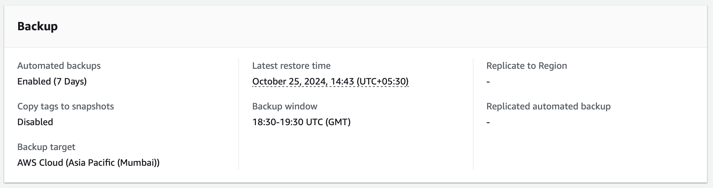
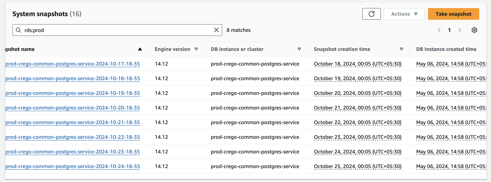
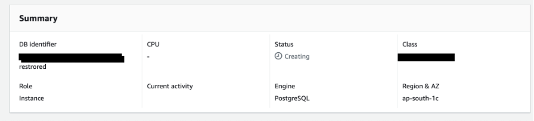
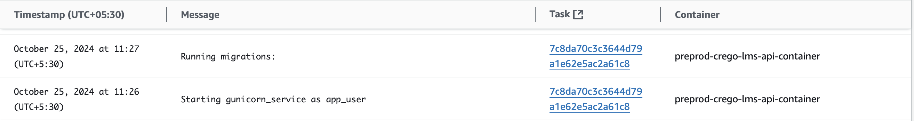
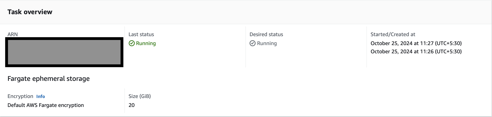

# DR Drill Report October, 2024 (1)

> **Crego Technologies Private LTD**
> 

> **Drill Date:** October 21–26, 2024
> 

> **Drill Time:** 09:00 AM – 05:00 PM
> 

> **Drill Lead:** Abhishek Sharma
> 

## Objectives of the Drill:

- To test the effectiveness of automated backup procedures for AWS RDS.
- To assess the duration and ease of the restoration process.
- To ensure restored data is compatible with the application.

## Backup Maintenance Procedures:

1. System/Server Details: Backup maintenance conducted on our AWS RDS instance running PostgreSQL.
2. Backup Procedure: System set up for daily automated backups with a 7-day retention period. Backups begin within a defined window.
    
    
    
    Image: screenshot of backup policy on AWS RDS
    
3. Data Included in Backup: All databases hosted on the AWS RDS instance, application data, transaction logs, and system metadata.
4. Verification of Backup: AWS RDS service provides a snapshot for verification. Daily backups checked and confirmed via the AWS RDS console.
    
    
    
    *Image: screenshot of Automated Backup of AWS RDS created daily.*
    

## Restoration Drill Procedures:

1. Restoration Procedure: On day 5, a new RDS instance was created from the most recent backup snapshot. Process initiated via AWS Management Console and monitored until completion.
    
    
    
    *Image: screenshot of creating new RDS Instance from backup*
    
2. Data Restored: All databases, application data, and transaction logs from the most recent backup restored successfully.
    
    
    
    Image: checking application logs for db connections.
    
3. Verification of Restoration: Performed through systematic query checks on the database and thorough assessment of application data.
    
    
    
    *Image: screenshot of Application running successfully.*
    
4. Restoration Timing: Entire restoration process took approximately 30 minutes.

## Results and Observations:

1. Successes: Backup and restoration process carried out smoothly without interruptions. Application successfully tested with new RDS instance and worked as expected.
2. Challenges: No significant challenges encountered during the drill.
3. Deviations from Plan: None.

## Recommendations and Next Steps:

1. Recommendations: Continue with current backup and restoration procedures given successful execution of the drill.
2. Next Steps: Next backup and restoration drill scheduled for January 10, 2025. Future drills will aim to further reduce restoration time and conduct more extensive application testing.

## Conclusion

Our current system can recover data from as recently as **5 minutes ago up to 7 days** in the past. This allows for near-instant data restoration, meeting real-time Recovery Point Objective (RPO) requirements.

For Recovery Time Objective (RTO), we aim to restore services as quickly as possible after an issue. While actual recovery time varies depending on the problem's size and type, we've successfully restored within 30 minutes. However, it may take up to **3 hours** depending on data size and type.

## **Approval and Sign-off:**

> **Approved by:** Abhishek Sharma
> 

> **Date:** October 26, 2024
>