# Licence store migration — DynamoDB → FleetView

**Status:** Proposal · not accepted · no live system changed by this document
**Scope:** moving licence ownership off DynamoDB/Supabase onto FleetView's `tenant_licenses` + `license_keys`
**Depends on:** [`LICENSING.md`](../LICENSING.md) §8 (the L0–L5 arc), contract C5
**Supersedes nothing.** It is the execution plan for LICENSING.md's ⛔ rows.

```
WHAT   Move 39 licences / 45 keys off DynamoDB onto FleetView, one tenant at a time.
WHY    FleetView is built through L3 and serving nobody; the store it replaces mints
       keys nobody installs, on a host no repo can name.
IMPACT 6 phases · 4 read-only before the first write · every step reversible until
       the external store is deleted · 1 importer bug to fix before --apply.
```

---

## 1 · Where the data lives today

What to notice: **one reader, one hop, and the hop is unidentified.**

```
WRITERS                                    READER (there is exactly one)

[crego-license UI]──┐                      (crego-omni) Django, DB-per-tenant
  Lovable+Supabase  │                          │
                    ├──> (Supabase Edge Fn)    │ Setting.license_settings
[add-tenant.yaml]───┘         │  SigV4         │   .secret    ← pasted by hand
  crego-infra CI              ▼                │   .endpoint  ← THE CUTOVER LEVER
                          {DynamoDB}           │
                        PK secret_key          ▼
                        PLAINTEXT ⚠        Redis 1h TTL
                              ╎                │  miss
                              ╎                ▼
                        ??? NOTHING IN ANY REPO SERVES THIS HOP ⚠
                              ╎                │
                              └──────> (license.crego.ai/verify)
                                               │ any non-200 / timeout
                                               ▼
                                        verified=False, features={}
                                        403 EVERYTHING · FAIL CLOSED ⚠
```

Three hostnames claim to be that box, and they disagree:

| Claimed by | Host |
|---|---|
| omni `settings/base.py:416` | `license.crego.ai` |
| crego-infra script | `license.crego.io` |
| `externalsecret.yaml` docs | `license.example.com` |

---

## 2 · Where it goes

What to notice: **the licence row carries its own grants, so the registry is not a dependency.**

```
[apps/api]──ActionService──> {tenant_licenses}      issue · rotate · revoke
  operator, OIDC              {license_keys}        sha256 only, never plaintext
                                    │
                                    │ leftJoin tenants/plans/tenant_envs
                                    ▼   ← LEFT, verified: store.ts:59-75
[apps/license] POST /verify ────────┘
  public · no OIDC · no writes but last_seen_at
  in-proc cache · rate limited
        ▲
        │ 200 {is_active, features}
  (crego-omni)  Setting.license_settings.endpoint = https://<fleetview>/verify
```

**Consequence of that `leftJoin`:** a licence for a tenant absent from `clients.yaml`
still verifies, off the grants imported verbatim from DynamoDB. The 15 unregistered
tenants in `tenant-reconciliation-2026-08-01.xlsx` are **not a blocker** for this
migration and must not be sequenced behind the registry reconciliation.

---

## 3 · Phases

```mermaid
flowchart LR
    M0["M0 DISCOVER<br/>read-only"] --> M1["M1 RECONCILE<br/>read-only"]
    M1 --> M2["M2 MIRROR<br/>write: FleetView only"]
    M2 --> M3["M3 CANARY<br/>1 dev tenant"]
    M3 --> M4["M4 ROLLOUT<br/>staged, per tenant"]
    M4 --> M5["M5 OWN<br/>issuance moves"]
    M5 --> M6["M6 RETIRE<br/>DNS, then delete"]

    style M0 fill:#dff0d8,stroke:#3c763d
    style M1 fill:#dff0d8,stroke:#3c763d
    style M2 fill:#fcf8e3,stroke:#8a6d3b
    style M3 fill:#fcf8e3,stroke:#8a6d3b
    style M4 fill:#fcf8e3,stroke:#8a6d3b
    style M5 fill:#f2dede,stroke:#a94442
    style M6 fill:#f2dede,stroke:#a94442
```



Legend — green = **no live system touched** · amber = **reversible** · red = **one-way**

| # | Phase | Read/Write | Blast radius | Undo |
|---|---|---|---|---|
| M0 | Discover | **read** | none | n/a |
| M1 | 3-way reconcile | **read** | none | n/a |
| M2 | Mirror | write — *FleetView DB only* | none downstream | `DELETE FROM tenant_licenses/license_keys` |
| M3 | Canary | write — 1 tenant's JSON field | 1 dev tenant | put the field back |
| M4 | Rollout | write — N tenants' JSON field | 1 tenant at a time | put the field back |
| M5 | Own | write — CI + runbooks | new tenants only | revert the workflow |
| M6 | Retire | **DNS, then deletion** | whole fleet | ⚠ **none past deletion** |

---

### M0 · Discover — answer what no repo can

All three are **reads**. Do not change a record you find.

- [ ] **Find what serves `/verify`.** DNS zone for `crego.ai` + `crego.io` → what does the record point at? A load balancer, a Lambda, an API Gateway? Until this is named, cutover risk is unbounded.
- [ ] **Determine which hostname is live**, and which tenants resolve to which. `.ai` vs `.io` (finding 5).
- [ ] **Confirm who owns the DNS zone** and how long a change takes to propagate — that number sets the M6 window.
- [ ] **Take a fresh DynamoDB console export** (CSV). The last one is stale and uncommitted.

Exit gate: the box marked `???` in §1 has a name, an owner, and a TTL.

---

### M1 · Reconcile — three sources, not two

The DynamoDB half is done. **The half that breaks prod is not.**

```
{DynamoDB}  ────┐
  50 rows       │
                ├──> 3-WAY DIFF ──> per-tenant verdict
{tenant DBs}────┤                    ok | key-only-in-DB ⚠ | key-only-in-Dynamo
  Setting.      │                    | grants disagree | expired-but-active
  license_      │
  settings      │     ⚠ NOT DONE — needs omni omni-access
                │
{FleetView} ────┘
  clients.yaml registry (context only, NOT a gate)
```

- [ ] Get read access to every tenant Postgres; dump `Setting.license_settings` (`.secret`, `.endpoint`) for all 28 tenants × their envs.
- [ ] Re-run `pnpm license:import -- <fresh.csv>` — **report mode opens no DB connection** (`createDb()` is inside the `--apply` branch), so this is safe anywhere.
- [ ] Resolve the **5 rows with no derivable environment** → `--env <store-tenant>=<env>`. Check `tenant_envs.domain` first; a bare `<tenant>.<suffix>` is production.
- [ ] Triage the **~20 anomalies**:

| Anomaly | Meaning | Decision needed |
|---|---|---|
| expired but still active | term lapsed, omni never checked (finding 6) | renew or let `/verify` refuse on cutover |
| unknown modules | silent no-op in the product today (finding 7) | drop, or add to the catalogue |
| key prefix ≠ tenant | naming drift — e.g. `tyger` ex-Adani | confirm the mapping by hand |

- [ ] **A key live in a tenant DB but absent from DynamoDB blocks that tenant.** This is the single most likely way to break prod. It cannot be found without the tenant-DB dump.

Exit gate: every tenant is `ok` or has a written decision. No tenant is `unknown`.

---

### M2 · Mirror — the first write, and it is invisible

```bash
pnpm license:import -- <fresh.csv> --apply --env <t>=<env> ...
```

`tenant_licenses` UPSERT (dedup by `(tenant, env)`, lead = **row expiring last**)
`license_keys` INSERT `ON CONFLICT DO NOTHING` on `key_hash` — **hashes only**, `hint` = last 4

⚠ **Fix the importer before running this.** See risk 1 below — as written, `--apply`
resurrects deactivated keys.

- [ ] Patch `import-external-store.ts` to set `revokedAt` for keys from `is_active: false` rows.
- [ ] Add a test for the import path — `packages/license` has none today.
- [ ] Run `--apply` against the production FleetView database.
- [ ] Spot-check: pick 3 tenants, confirm `SELECT` returns the grants the store holds.

Nothing downstream changes. Undo is a `DELETE`.

---

### M3 · Canary — one JSON field, one dev tenant

**The first change to a live system in this entire plan.**

```
BEFORE   Setting.license_settings = { secret: "...", }
                                     endpoint absent -> DEFAULT_LICENSE_ENDPOINT
                                                        (hardcoded, base.py:416)

AFTER ═> Setting.license_settings = { secret: "...",
                                      endpoint: "https://<fleetview>/verify" }  ✚

UNDO     delete the endpoint key. One field. One tenant.
```

- [ ] Pick a dev tenant with a **verified-ok** M1 verdict.
- [ ] Set `.endpoint`. Flush that tenant's `tenant:{alias}:settings:license_data` Redis key.
- [ ] Watch: `last_seen_at` on the key must become non-null within the hour. **That is the only proof the key was ever installed.**
- [ ] Soak ≥ 1 week. Confirm the tenant's modules behave identically — especially anything gated by `core`.

Exit gate: `last_seen_at` populated, zero 403 reports, entitlements byte-identical.

---

### M4 · Rollout — staged, never bulk

```
dev tenant #1  ──soak 1wk──> remaining dev ──> preprod ──> prod, ONE AT A TIME
                                                            └─ each with a named
                                                               owner + rollback
```

- [ ] Never move more than one prod tenant per change window.
- [ ] Before each prod tenant: confirm its `last_seen_at` went live in a lower env first.
- [ ] Track which tenants still resolve the old hostname — that count is M6's input.

---

### M5 · Own — issuance moves, and the collision gets resolved

Today **both** systems would mint. Pick one, and it must be FleetView.

| Defect | Fix in this phase |
|---|---|
| 1 · `add-tenant.yaml` already mints + FleetView's `add_tenant` wraps it | Strip the Supabase PUT from the workflow; FleetView `issue_license` becomes the only minter |
| 2 · key never delivered — masked into `$GITHUB_OUTPUT`, human pastes it | Ship "shown once, operator pastes" as the floor. Pursue an omni management command. **Never leave a tenant keyless.** |
| 3 · new tenants born broken — `core` missing | Enforce the `core` floor at write time (already built in `packages/license`) |
| 7 · 4 drifted module catalogues | omni's `MODULE_ENDPOINT_MAP` (16) is authoritative; reject unknowns at write |
| 9 · rotation is Django-admin-only | `rotate_license` exists; needs the delivery path from defect 2 |
| 11 · offboarding deactivates via the same Supabase API | Must move in **lockstep** with issuance, or an offboarded tenant stays licensed |
| 4 · `LICENSE_ENDPOINT`/`LICENSE_SECRET` dead config | Delete from `create-secret-json.sh` and every `externalsecret.yaml` |

---

### M6 · Retire — DNS last, deletion never early

**Why DNS is last, not first:** a Route 53 change moves every tenant at once and
cannot be undone tenant by tenant. The `.endpoint` field moves exactly one and can.
DNS exists only to **catch stragglers** — tenants still on the hardcoded
`DEFAULT_LICENSE_ENDPOINT` that nobody wants to touch with an omni release.

```
  [ ] repoint DNS          ← only when the straggler count is KNOWN and SMALL
        │
        │ soak — old store still populated, still answering
        ▼
  [ ] stop writes to DynamoDB / Supabase
        │
        │ soak ≥ 30 days, store intact and readable
        ▼
  [ ] snapshot the table to cold storage
        │
        ▼
  ✗ delete DynamoDB + Supabase Edge Fn + crego-license UI
        ═══ POINT OF NO RETURN ═══
```

---

## 4 · The omni asks

Cutover works without these. It is **much better** with them.

| Ask | Size | Without it |
|---|---|---|
| **Stale-serve** last-known-good on failure, `SettingService.get_license_data` | ~20 lines | FleetView outage > 1h = **every tenant 403s**. This is the SPOF. |
| Delivery — internal endpoint or management command | small | Every issue/rotate needs a human in Django admin |
| Rotation — machine path | small | Same |

**Recommendation:** make stale-serve a **precondition of M4-prod**, not a nice-to-have.
It converts a FleetView outage from "product down" to "entitlements frozen." The other
two are quality-of-life and can trail.

---

```
⚠ EASY TO MISS

1. THE IMPORTER RESURRECTS DEAD KEYS.  Verified, and not in LICENSING.md's
   defect list.  `--apply` groups rows by (tenant, env) and inserts a
   license_keys row for EVERY row in the group — including rows with
   is_active: false — and never sets `revokedAt`
   (import-external-store.ts:339-357).  The licence row takes its status from
   the lead row only.  So a key deactivated in DynamoDB is imported LIVE, and
   store.ts gates solely on `revokedAt !== null`.  An offboarded tenant's old
   key would verify.  FIX BEFORE M2.

2. THE TENANT-DB HALF OF RECONCILIATION IS THE ONE THAT BREAKS PROD, and it is
   the half not done.  A key live in a tenant's Postgres but absent from
   DynamoDB verifies today (it is the store's PK that matters, and omni only
   sends what it holds) and will FAIL the moment that tenant points at
   FleetView.  DynamoDB-only reconciliation cannot see it.

3. NOTHING REJECTS A DANGLING LICENCE.  `tenant_licenses` has no FK to
   `tenants`.  Combined with the leftJoin this is deliberate and useful — but
   it means a typo'd tenant_key in an --env override writes silently and
   verifies nothing.  Spot-check M2 output against the registry by eye.

4. `last_seen_at` IS THE ONLY EVIDENCE A KEY WAS EVER INSTALLED.  A licence
   minted and never delivered looks identical to a healthy one.  Every phase
   gate above keys off it for that reason — do not substitute "we set the
   field" for "the tenant called us".

5. DUAL ISSUANCE IS LIVE FROM M2 UNTIL M5.  During that window add-tenant.yaml
   still PUTs to Supabase while FleetView holds the mirror.  Any tenant
   onboarded mid-migration must be re-imported or hand-added, or it exists in
   one store only.  Keep the window short, or freeze onboarding across it.

6. OFFBOARDING SHARES THE ISSUANCE API.  If M5 moves issuance without moving
   offboarding in lockstep, deactivation silently stops taking effect and an
   offboarded tenant stays licensed.
```

---

## 5 · Open decisions

| # | Question | Needed by | Who |
|---|---|---|---|
| 1 | What serves `license.crego.ai/verify`? | M0 exit | infra + DNS zone access |
| 2 | `.ai` or `.io` — which is live? | M0 exit | infra |
| 3 | Omni DB read access for all 28 tenants | M1 start | omni team |
| 4 | Will omni take stale-serve? | M4-prod | omni team |
| 5 | Expired-but-active tenants — renew or let lapse? | M1 exit | commercial |
| 6 | Freeze onboarding during M2→M5? | M2 start | this team |
