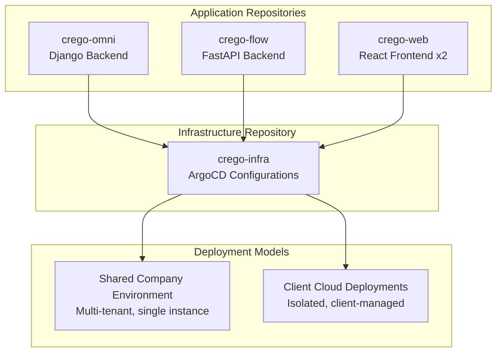
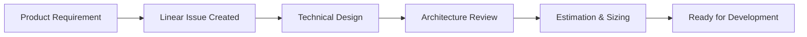
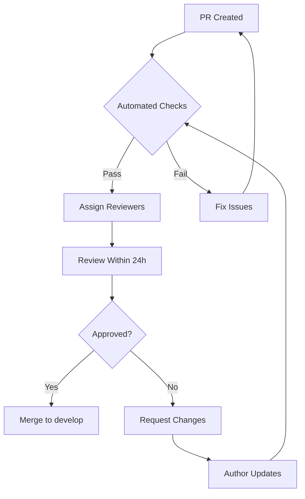
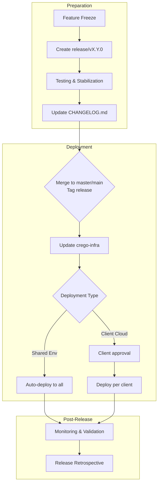
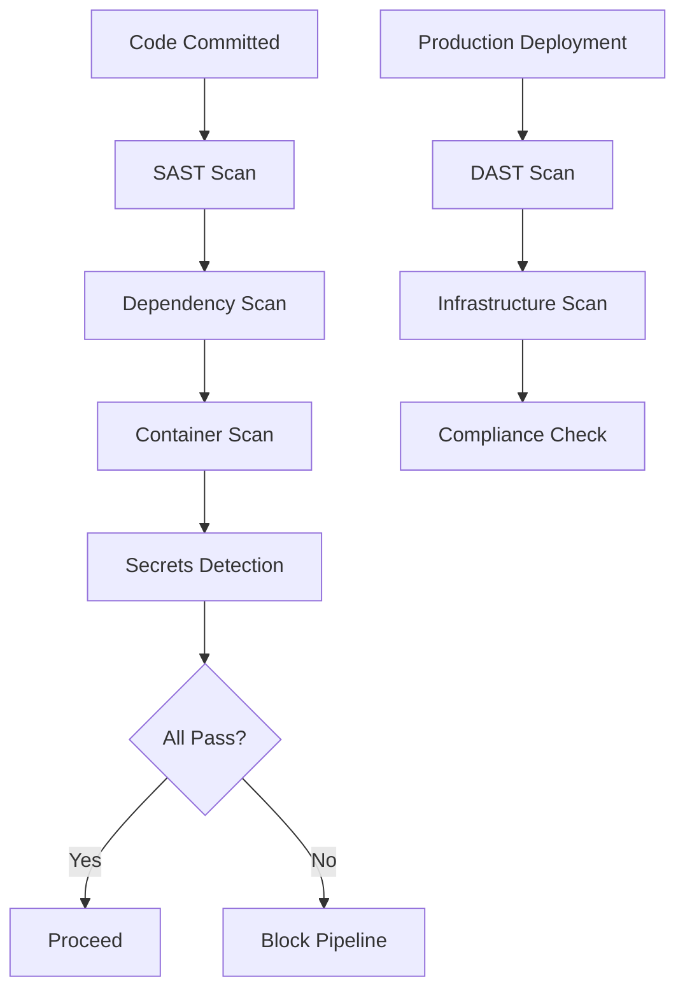
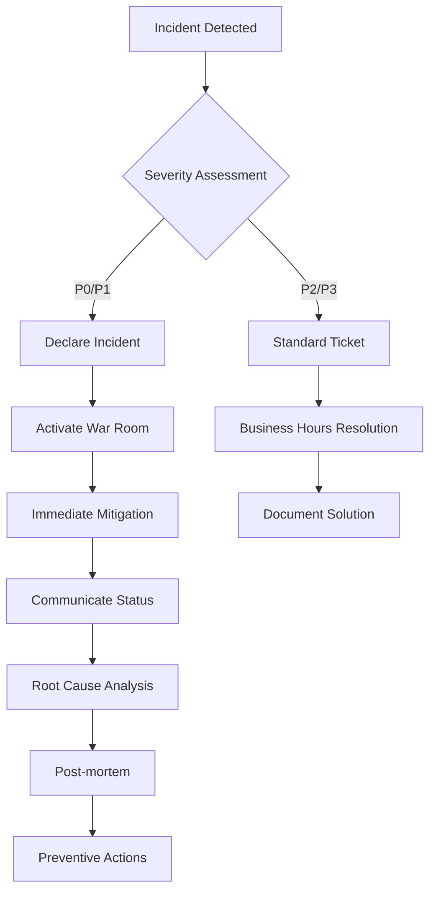
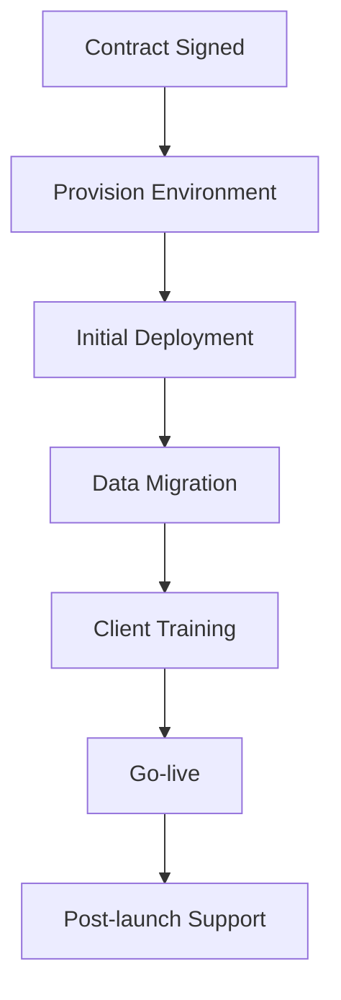

## 📖 **Introduction**

### **Purpose**

This document outlines the complete Software Development Lifecycle (SDLC) for Crego's multi-tenant SaaS platform. It covers everything from planning to production operations, ensuring consistency across teams and repositories.

### **Scope**

- All development teams (Backend, Frontend, Infrastructure)
- All repositories (crego-omni, crego-flow, crego-web, crego-infra)
- Both deployment models (Shared environment & Client cloud)

### **Guiding Principles**

- **Automation First:** Automate everything that can be automated
- **Security by Design:** Security considerations at every phase
- **Client-Centric:** Different workflows for different client types
- **Quality Gates:** No shortcuts on quality checks
- **Continuous Improvement:** Regular retrospectives and process updates

---

## 🏗️ **Architecture Overview**

### **Repository Architecture**



### **System Components**

| Component | Technology | Purpose | Team |
| --- | --- | --- | --- |
| Omni Service | Django | Core business logic | Backend Team |
| Flow Service | FastAPI | Workflow engine | Backend Team |
| Web Portal | React | Admin interface | Frontend Team |
| User Portal | React | End-user interface | Frontend Team |
| Infrastructure | Kubernetes/ArgoCD | Deployment orchestration | DevOps Team |

---

## 📁 **Repository Structure**

### **Application Repositories**

```
crego-omni/ (Django)
├── src/
├── tests/
├── configs/
│   ├── base.yaml
│   └── overlays/
├── Dockerfile
└── .github/

crego-flow/ (FastAPI)
├── src/
├── tests/
├── configs/
│   ├── base.yaml
│   └── overlays/
├── Dockerfile
└── .github/

crego-web/ (React Mono-repo)
├── apps/
│   ├── admin-portal/
│   └── user-portal/
├── packages/
│   └── shared-components/
├── Dockerfile (multi-stage)
└── .github/

```

### **Infrastructure Repository**

```
crego-infra/ (ArgoCD GitOps)
├── base/                    # Common templates
│   ├── kustomization.yaml
│   ├── namespace.yaml
│   └── network-policies.yaml
├── envs/                    # Shared environments
│   ├── dev/
│   ├── uat/
│   ├── preprod/
│   └── prod/
├── clouds/                  # Cloud provider configs
│   ├── aws/
│   ├── gcp/
│   └── azure/
├── clients/                 # Client-specific configs
│   ├── client-a/
│   └── client-b/
├── scripts/
└── .github/

```

---

## 🌿 **Git Branching Strategy**

### **Core Branches (All Repos)**

| Branch | Purpose | Protected | Merge Strategy |
| --- | --- | --- | --- |
| `master`/`main` | Production code (master for crego-ai/flow/omni; main for crego-web/infra) | Yes | Merge Commit |
| `develop` | Integration | Yes | Squash |
| `release/*` | Release prep | Yes | Merge Commit |
| `feature/*` | Feature dev | No | Squash |
| `hotfix/*` | Emergency fixes | No | Merge Commit |

### **Infrastructure Branches**

| Branch | Purpose | Protected |
| --- | --- | --- |
| `env/dev` | Development env | Yes |
| `env/uat` | UAT env | Yes |
| `env/preprod` | Pre-production | Yes |
| `env/prod` | Production templates | Yes |
| `clients/*` | Client-specific | Yes |

### **Branch Protection Rules**

```yaml
# GitHub Branch Protection Settings
main:
  required_approvals: 2
  required_status_checks: [build, test, security-scan]
  restrict_push: true

develop:
  required_approvals: 2
  required_status_checks: [build, test]

release/*:
  required_approvals: 2
  required_status_checks: [integration-test]
  allow_force_push: true

env/prod:
  required_approvals: 2 (SRE + Lead)
  required_status_checks: [terraform-validate, cost-check]

```

---

## 🔄 **Development Workflow**

### **1. Planning Phase**



**Artifacts:**

- 📝 Product Requirements Document (PRD)
- 🏗️ Technical Design Document (TDD)
- 📋 Architecture Decision Record (ADR)
- ⚠️ Risk Assessment Matrix

### **2. Development Phase**

**Step-by-Step Process:**

### **Step 1: Create Feature Branch**

```bash
# From Linear issue #ABC-123
git checkout develop
git pull origin develop
git checkout -b feature/ABC-123-description

```

### **Step 2: Local Development**

- Follow coding standards (black, eslint)
- Write unit tests (70%+ coverage)
- Update documentation
- Run pre-commit hooks

### **Step 3: Create Pull Request**

```bash
git push origin feature/ABC-123-description
# Create PR to develop with template

```

### **PR Template:**

```markdown
## Description
[What does this PR do?]

## Linear Issue
[Link to Linear issue]

## Changes
- [ ] Breaking change (requires version bump)
- [ ] Database migration
- [ ] Configuration change

## Testing
- [ ] Unit tests added
- [ ] Integration tests added
- [ ] Manual testing completed

## Documentation
- [ ] Updated README
- [ ] Updated API docs
- [ ] Added ADR if needed

## Deployment Notes
[Any special deployment requirements]

```

### **3. Code Review Process**



**Review Checklist:**

- ✅ Code follows standards
- ✅ Tests are adequate
- ✅ No security vulnerabilities
- ✅ Performance considered
- ✅ Documentation updated
- ✅ Backward compatibility maintained

---

## 🧪 **Testing Strategy**

### **Testing Pyramid**

```
┌─────────────────┐
│   E2E Tests     │ (10%)
├─────────────────┤
│ Integration     │ (20%)
├─────────────────┤
│   Unit Tests    │ (70%)
└─────────────────┘

```

### **Test Requirements**

| Test Type | Owner | Automation | Environment | Coverage |
| --- | --- | --- | --- | --- |
| Unit | Developer | 100% | Local/CI | >70% |
| Integration | Developer | 80% | CI | Critical paths |
| E2E | QA Engineer | 70% | Staging | User journeys |
| Performance | SRE | 100% | PreProd | Load scenarios |
| Security | Security Team | 100% | All | OWASP Top 10 |

### **Local Testing Commands**

```bash
# Backend (Python)
pytest --cov=src --cov-report=html
black --check src/
flake8 src/

# Frontend (React)
npm run test:coverage
npm run lint
npm run build

# Infrastructure (Terraform)
terraform validate
terraform plan

```

---

## 🚀 **Release Management**

### **Release Calendar**

| Frequency | Type | Deployment Window | Lead Time |
| --- | --- | --- | --- |
| Weekly | Hotfixes | Anytime | 2 hours |
| Monthly | Minor Releases | Business hours | 1 week |
| Quarterly | Major Releases | Weekend | 2 weeks |

### **Release Process**



### **Versioning Strategy**

```
Semantic Versioning: vMAJOR.MINOR.PATCH
- MAJOR: Incompatible API changes
- MINOR: New backward-compatible functionality
- PATCH: Backward-compatible bug fixes

Special Tags:
- v2.1.0-rc.1    → Release Candidate
- v2.1.0-alpha   → Alpha testing
- v2.1.0-beta    → Beta testing

```

---

## ⚙️ **CI/CD Pipeline**

### **Pipeline Stages**

```yaml
name: Build and Deploy
on:
  push:
    branches: [main, develop, release/*]
  pull_request:
    branches: [main, develop]

jobs:
  build-and-test:
    runs-on: ubuntu-latest
    steps:
      - checkout
      - setup
      - build
      - unit-test
      - integration-test
      - security-scan
      - containerize

  deploy-dev:
    needs: build-and-test
    if: github.ref == 'refs/heads/develop'
    runs-on: ubuntu-latest
    steps:
      - deploy-to-dev
      - smoke-test

  deploy-preprod:
    needs: build-and-test
    if: contains(github.ref, 'release/')
    runs-on: ubuntu-latest
    steps:
      - deploy-to-preprod
      - performance-test
      - await-approval

  deploy-prod:
    needs: deploy-preprod
    if: github.ref == 'refs/heads/main'
    runs-on: ubuntu-latest
    steps:
      - deploy-to-prod
      - health-check
      - post-deploy-validation

```

### **Environment Configuration**

| Environment | Purpose | Auto-deploy | Approval Required |
| --- | --- | --- | --- |
| Development | Daily development | Yes | No |
| UAT | User acceptance | Yes | Product Manager |
| PreProd | Final validation | Yes | Tech Lead + QA |
| Production | Live clients | No | SRE + Client (if cloud) |

---

## 👁️ **Monitoring & Observability**

### **Monitoring Stack**

| Component | Tool | Purpose | Alert Threshold |
| --- | --- | --- | --- |
| Metrics | Prometheus | System metrics | CPU > 80% for 5m |
| Logging | ELK Stack | Application logs | Error rate > 1% |
| Tracing | Jaeger | Request tracing | P95 latency > 500ms |
| Alerting | PagerDuty | Notifications | P0: Immediate |
| Dashboards | Grafana | Visualization | Custom per service |

### **Error Tracking & Performance Monitoring with Sentry**

Sentry provides comprehensive error tracking and performance monitoring across all Crego platform services with full multi-tenant context enrichment and release tracking.

#### Integration Scope

- **Backend Services**: Django (crego-omni), FastAPI (crego-flow)
- **Frontend Applications**: React (omni-web, flow-web)
- **Background Workers**: Celery workers and beat schedulers
- **Multi-Tenant Context**: Automatic tenant ID, alias, domain, tier enrichment
- **Release Tracking**: Correlate errors with deployment versions
- **Performance Monitoring**: Transaction traces, profiling, and performance insights

#### Configuration

**Backend Services (Runtime Environment Variables):**
- Loaded from cloud secret managers (AWS/GCP) via External Secrets Operator
- Injected into Kubernetes pods at runtime
- See `crego-infra/docs/environment-variables.md` for complete reference

**Frontend Services (Build-Time Variables):**
- Compiled into static JavaScript bundles during CI/CD build
- Cannot be changed at runtime (requires rebuild)
- Source maps uploaded automatically during build

**Reference Documentation:**
- Infrastructure setup: `crego-infra/CLAUDE.md` (Sentry section)
- Environment variables: `crego-infra/docs/environment-variables.md`
- Backend usage: `crego-omni/README.md`, `crego-flow/README.md`

#### Development Practices

##### 1. Automatic Error Tracking

Most errors are captured automatically without manual instrumentation:

- **Services and API endpoints**: Automatically instrumented via `BaseService` (Django) and FastAPI integration
- **HTTP requests**: All incoming requests automatically create transactions
- **Celery tasks**: Background tasks automatically tracked with tenant context
- **Database queries**: Slow queries automatically flagged in performance traces

**When to use automatic tracking:**
- Standard CRUD operations via services
- API endpoint implementations
- Background task execution
- Most application errors

**No manual instrumentation needed** for typical service layer operations.

##### 2. Performance Monitoring

Use manual tracing for critical operations that need performance insights:

**When to add manual tracing:**
- Bulk operations (>10 items)
- Complex calculations (>100ms execution time)
- External API calls
- Multi-step workflows
- Background job processing steps

**Django/Backend Example:**
```python
from project.lib.sentry_utils import sentry_trace, sentry_transaction

# Decorator for function-level tracing
@sentry_trace(op="invoice.bulk_approve", description="Bulk approve invoices")
def bulk_approve_invoices(invoice_ids):
    # Function execution automatically tracked with timing
    for invoice_id in invoice_ids:
        approve_invoice(invoice_id)

# Context manager for block-level tracing
def process_monthly_invoices():
    with sentry_transaction(op="invoice.monthly_processing", name="Monthly invoice processing"):
        invoices = get_pending_invoices()
        for invoice in invoices:
            process_invoice(invoice)
```

**FastAPI/Workflow Example:**
```python
import sentry_sdk

async def execute_workflow(flow_id):
    # Create transaction for workflow execution
    with sentry_sdk.start_transaction(op="workflow.execute", name=f"Execute Flow {flow_id}"):
        nodes = await get_workflow_nodes(flow_id)

        # Create spans for each node execution
        for node in nodes:
            with sentry_sdk.start_span(op="node.execute", description=node.type):
                await execute_node(node)
```

##### 3. Custom Context (When to Add)

Add domain-specific context to help debug errors:

**Backend - Add Business Context:**
```python
import sentry_sdk

# Add context for financial operations
sentry_sdk.set_context("invoice", {
    "invoice_id": invoice.id,
    "total_amount": str(invoice.total_amount),
    "status": invoice.status,
    "payment_method": invoice.payment_method
})

# Add context for workflow operations
sentry_sdk.set_context("workflow", {
    "flow_id": flow.id,
    "node_count": len(nodes),
    "execution_mode": "async"
})
```

**Frontend - Add User Interaction Context:**
```typescript
import * as Sentry from '@sentry/react';

// Add context for form submission
Sentry.setContext('form_submission', {
  form_name: 'invoice_approval',
  field_count: 12,
  validation_errors: errors.length
});

// Add context for feature usage
Sentry.setContext('feature', {
  feature_name: 'bulk_invoice_approval',
  item_count: selectedInvoices.length
});
```

**When to add custom context:**
- Financial transactions (amounts, account numbers, transaction IDs)
- Workflow execution (flow IDs, node types, execution state)
- User interactions (form data, navigation path, feature flags)
- Integration failures (external service names, API endpoints)

##### 4. Error Handling Best Practices

**Capture These Errors:**
- ✅ Unexpected exceptions (system failures)
- ✅ Integration failures (external API errors)
- ✅ Data inconsistencies (state violations)
- ✅ Infrastructure errors (database timeouts, connection failures)

**Don't Capture These:**
- ❌ User input validation errors (use `DRFValidationError` without Sentry)
- ❌ Expected 404s (resource not found is normal)
- ❌ Business rule violations (handled via normal error responses)
- ❌ Permission errors (use proper HTTP status codes)

**Example - Integration Failure (Capture):**
```python
import sentry_sdk
from project.lib.exceptions import BusinessRuleError

try:
    response = payment_gateway.charge(amount)
except RequestException as e:
    # Add context for debugging
    sentry_sdk.set_context("payment_gateway", {
        "gateway": "stripe",
        "amount": amount,
        "invoice_id": invoice.id
    })

    # Capture exception
    sentry_sdk.capture_exception(e)

    # Handle gracefully
    raise BusinessRuleError("Payment processing failed") from e
```

**Example - Validation Error (Don't Capture):**
```python
from rest_framework.exceptions import ValidationError as DRFValidationError

# Don't capture - this is expected user input error
if amount < 0:
    raise DRFValidationError({"amount": "Amount must be positive"})

# Sentry before_send hook already filters these
```

#### Monitoring Dashboards

**Sentry UI (Error Tracking):**
- Error rate trends and spikes
- Error grouping and prioritization
- Release health monitoring
- User feedback and issue details
- Filter by tenant, user, release version

**Sentry UI (Performance Monitoring):**
- Transaction throughput and duration
- Slow operation identification
- Database query performance
- External API response times
- P50, P75, P95, P99 latency percentiles

**Grafana (Infrastructure Metrics):**
- System metrics (CPU, memory, disk)
- Database connection pooling
- Redis cache hit rates
- Message queue depth
- Pod resource utilization

**PagerDuty (Alert Routing):**
- Sentry alerts routed via PagerDuty
- On-call engineer paging
- Escalation policies
- Incident management

#### Alert Configuration

**New Errors:**
- Alert on first occurrence of new error type
- Severity: Medium (investigate within 24 hours)
- Exclude: Validation errors, permission errors

**Error Rate Spikes:**
- Alert when error rate increases >10% vs. baseline (7-day average)
- Severity: High (investigate within 1 hour)
- Include: All 5xx server errors
- Exclude: 4xx client errors

**Performance Degradation:**
- Alert when P95 latency exceeds 2x baseline
- Severity: Medium (investigate within 4 hours)
- Critical endpoints: Invoice approval, payment processing
- Monitor: Database queries, external API calls

**Release Health:**
- Alert when new release has >5% error rate
- Severity: Critical (investigate immediately, consider rollback)
- Monitor: First 1 hour after deployment

**Configuration in Sentry:**
1. Navigate to: Alerts → Create Alert Rule
2. Set conditions: Error rate, performance thresholds
3. Configure notifications: PagerDuty, Slack, email
4. Set alert frequency: Immediate, hourly digest, daily summary

#### References

For detailed usage examples and troubleshooting:

- **Backend Usage**: `crego-omni/README.md` (Sentry Integration section)
- **FastAPI Usage**: `crego-flow/README.md` (Monitoring & Error Tracking section)
- **Infrastructure Setup**: `crego-infra/CLAUDE.md` (Sentry section)
- **Environment Variables**: `crego-infra/docs/environment-variables.md`
- **Alert Investigation**: `crego-internal-docs/runbooks/sentry-alert-investigation.md`
- **Release Tracking**: `crego-internal-docs/release-management/team-release-playbook.md`

### **Key Metrics to Monitor**

```yaml
Application Metrics:
  - error_rate: < 0.1%
  - p95_response_time: < 200ms
  - throughput: per service
  - availability: 99.95%

Business Metrics:
  - active_tenants: count
  - feature_usage: per feature
  - user_satisfaction: CSAT score

Infrastructure Metrics:
  - cpu_usage: < 80%
  - memory_usage: < 85%
  - disk_usage: < 90%
  - network_latency: < 100ms

```

### **Alert Severity Levels**

| Level | Response Time | Notification | Example |
| --- | --- | --- | --- |
| P0 | Immediately | Page + Slack | Service down |
| P1 | 30 minutes | Page | High error rate |
| P2 | 2 hours | Slack | Performance degradation |
| P3 | Next day | Email | Capacity planning |

---

## 🛡️ **Security & Compliance**

### **Security Requirements**



### **Compliance Framework**

```
SOC2 Requirements:
├── Security
├── Availability
├── Processing Integrity
├── Confidentiality
└── Privacy

Monthly Activities:
├── Vulnerability scanning
├── Access review
├── Audit log review
├── Backup verification
└── Incident response drill

```

### **Security Gates**

| Gate | Tool | Frequency | Owner |
| --- | --- | --- | --- |
| SAST | SonarQube | Every commit | Dev Team |
| SCA | Snyk | Daily | Security Team |
| DAST | OWASP ZAP | Weekly | Security Team |
| Container Scan | Trivy | Every build | DevOps |
| Secrets Scan | GitGuardian | Every commit | All Teams |

---

## 🚨 **Incident Management**

### **Incident Response Process**



### **On-call Rotation**

| Role | Primary | Secondary | Escalation |
| --- | --- | --- | --- |
| Developer | 1 week | Backup dev | Tech Lead |
| SRE | 1 week | Backup SRE | Head of DevOps |
| Support | 24/7 | Tier 2 | Client Success |

### **Communication Template**

```markdown
## Incident: [Title]
**Severity:** P0/P1/P2/P3
**Start Time:** [Timestamp]
**Impact:** [Services/Clients affected]
**Status:** Investigating/Identified/Mitigating/Resolved
**Next Update:** [Time]

## Timeline
- [Time] Incident detected
- [Time] War room activated
- [Time] Mitigation in progress

## Action Items
- [ ] [Task]
- [ ] [Task]

```

---

## 📚 **Documentation Standards**

### **Documentation Hierarchy**

```
docs/
├── architecture/
│   ├── adr/              # Architecture Decision Records
│   ├── diagrams/         # System diagrams
│   └── patterns/         # Design patterns
├── api/
│   ├── openapi/          # OpenAPI specifications
│   └── client-sdks/      # SDK documentation
├── guides/
│   ├── development/      # Dev setup guides
│   ├── deployment/       # Deployment guides
│   └── troubleshooting/  # Troubleshooting guides
├── clients/
│   ├── onboarding/       # Client onboarding
│   ├── operations/       # Operational guides
│   └── faq/             # Frequently asked questions
└── runbooks/            # Operational runbooks

```

### **ADR Template**

```markdown
# ADR-001: [Title]

## Status
[Proposed | Accepted | Deprecated | Superseded]

## Context
[What is the issue that we're seeing?]

## Decision
[What is the change that we're proposing?]

## Consequences
[What becomes easier or more difficult?]

```

---

## 👥 **Team Roles & Responsibilities**

### **RACI Matrix**

| Activity | Product | Development | QA | SRE | Security |
| --- | --- | --- | --- | --- | --- |
| Feature Planning | A/R | C | I | I | I |
| Development | I | R | C | I | C |
| Code Review | I | R/C | C | I | I |
| Testing | I | C | R | I | I |
| Deployment | I | C | I | R | C |
| Incident Response | I | C | I | R | C |
| Security Review | I | C | I | C | R |

**Legend:** R = Responsible, A = Accountable, C = Consulted, I = Informed

### **Escalation Path**

```
Level 1: On-call Engineer (30 min response)
  ↓ (if unresolved in 1 hour)
Level 2: Tech Lead / Senior Engineer
  ↓ (if critical or 2+ hours)
Level 3: Head of Engineering
  ↓ (if P0 or business critical)
Level 4: CTO / VP Engineering

```

---

## 🛠️ **Toolchain Configuration**

### **Required Tools**

| Category | Tool | Purpose | Configuration |
| --- | --- | --- | --- |
| Version Control | GitHub | Source code | Branch protection |
| CI/CD | GitHub Actions | Automation | Workflow files |
| Issue Tracking | Linear | Task management | Project boards |
| Documentation | Notion/Confluence | Knowledge base | Templates |
| Monitoring | Prometheus/Grafana | Observability | Dashboards |
| Logging | ELK Stack | Log management | Index patterns |
| Alerting | PagerDuty | Notifications | Escalation policies |
| Security | Snyk/SonarQube | Security scanning | Quality gates |
| Communication | Slack | Team communication | Channels per team |

### **GitHub Repository Setup**

```yaml
# .github/settings.yml
repository:
  name: [repo-name]
  description: [description]

  # Branch Protection
  branches:
    - name: main
      protection:
        required_pull_request_reviews:
          required_approving_review_count: 2
        required_status_checks:
          strict: true
          contexts: [build, test, security-scan]
        enforce_admins: false
        restrictions: null

  # Labels
  labels:
    - name: bug
      color: d73a4a
    - name: feature
      color: 0075ca
    - name: security
      color: ff0000

```

---

## 📊 **Performance & Scalability**

### **Performance Requirements**

| Metric | Target | Measurement Frequency |
| --- | --- | --- |
| Response Time (p95) | < 200ms | Continuous |
| API Error Rate | < 0.1% | Continuous |
| Availability | 99.95% | Monthly |
| Concurrent Users | 10,000+ | Load testing |
| Data Volume | TB scale | Quarterly review |

### **Load Testing Schedule**

| Test Type | Frequency | Environment | Tools |
| --- | --- | --- | --- |
| Smoke Test | Weekly | PreProd | k6 |
| Load Test | Monthly | PreProd | Locust |
| Stress Test | Quarterly | Isolated | JMeter |
| Soak Test | Quarterly | PreProd | k6 |

### **Capacity Planning**

```
Process:
1. Monitor current usage trends
2. Project growth (3, 6, 12 months)
3. Identify bottlenecks
4. Plan infrastructure scaling
5. Budget approval
6. Implement scaling

Review Frequency: Quarterly

```

---

## 👤 **Client Management**

### **Client Onboarding Process**



### **Client Types & Support Levels**

| Client Type | Deployment | Support Hours | SLA | Upgrade Policy |
| --- | --- | --- | --- | --- |
| Enterprise | Client Cloud | 24/7 | 99.95% | Client-controlled |
| Business | Shared Env | Business hours | 99.9% | Auto-upgrade |
| Startup | Shared Env | Business hours | 99.5% | Auto-upgrade |

### **Offboarding Process**

```
1. Contract termination notice
2. Data export preparation
3. Final data delivery
4. Environment decommissioning
5. Final billing
6. Knowledge transfer (if needed)

```

---

## 🔄 **Continuous Improvement**

### **Retrospective Process**

```yaml
Sprint Retrospective (Bi-weekly):
  Participants: Development Team
  Duration: 1 hour
  Format:
    - What went well?
    - What didn't go well?
    - Action items for next sprint

Release Retrospective (Monthly):
  Participants: Cross-functional team
  Duration: 2 hours
  Focus:
    - Deployment success rate
    - Client feedback
    - Process improvements

Quarterly Review:
  Participants: Leadership + Team Leads
  Duration: Half day
  Topics:
    - Architecture review
    - Technology stack evaluation
    - Team skills assessment
    - Strategic planning

```

### **Metrics Tracking**

| Metric | Target | Measurement | Owner |
| --- | --- | --- | --- |
| Lead Time for Changes | < 1 day | GitHub Analytics | Tech Lead |
| Deployment Frequency | Multiple/day | Deployment logs | DevOps |
| Change Failure Rate | < 5% | Incident reports | SRE |
| Mean Time to Recovery | < 1 hour | Incident logs | SRE |
| Code Coverage | > 70% | Test reports | QA |
| Security Vulnerabilities | 0 critical | Security scans | Security |

---

## 📋 **Checklists & Templates**

### **Pre-production Checklist**

```markdown
## Release Readiness Checklist

### Code Quality
- [ ] All tests passing
- [ ] Code coverage > 70%
- [ ] Security scans clean
- [ ] Performance tests passed
- [ ] Documentation updated

### Deployment
- [ ] Release branch created
- [ ] CHANGELOG updated
- [ ] Database migrations tested
- [ ] Rollback plan documented
- [ ] Client communications prepared

### Approval
- [ ] Product sign-off
- [ ] QA sign-off
- [ ] Security sign-off
- [ ] SRE sign-off

```

### **Post-deployment Checklist**

```markdown
## Post-deployment Validation

### Immediate (15 minutes)
- [ ] Health checks passing
- [ ] Error rates normal
- [ ] Response times normal
- [ ] Key business flows working

### First Hour
- [ ] Monitor dashboards
- [ ] Check client-specific metrics
- [ ] Validate data integrity
- [ ] Send deployment confirmation

### First 24 Hours
- [ ] Review performance metrics
- [ ] Check client feedback
- [ ] Monitor error logs
- [ ] Update documentation

```

---

## 🆘 **Emergency Procedures**

### **Rollback Procedures**

**Shared Environment Rollback:**

```bash
# 1. Identify last stable version
git tag -l | tail -5

# 2. Rollback infrastructure
git checkout env/prod
git reset --hard v2.1.0
git push --force origin env/prod

# 3. Verify rollback
kubectl get deployments
kubectl get pods

```

**Client Cloud Rollback:**

```bash
# 1. Revert client branch
git checkout clients/client-a/prod
git revert HEAD --no-edit
git push origin clients/client-a/prod

# 2. Notify client
# 3. Schedule root cause analysis

```

### **Disaster Recovery**

```
Recovery Time Objective (RTO): 4 hours
Recovery Point Objective (RPO): 15 minutes

Backup Strategy:
- Database: Hourly incremental, Daily full
- Files: Real-time replication
- Configuration: Version controlled

DR Test Frequency: Every 6 months

```

---

## 📞 **Support & Contact Information**

### **Internal Contacts**

| Role | Primary Contact | Backup Contact | Slack Channel |
| --- | --- | --- | --- |
| Development Lead | [Name] | [Name] | #dev-leads |
| SRE Lead | [Name] | [Name] | #sre-team |
| Security Lead | [Name] | [Name] | #security |
| Product Manager | [Name] | [Name] | #product-team |
| Client Success | [Name] | [Name] | #client-success |

### **External Contacts**

| Service | Contact | Purpose | SLA |
| --- | --- | --- | --- |
| AWS Support | Enterprise Support | Infrastructure | 15 min response |
| GitHub | Enterprise Support | Repository issues | 1 hour response |
| Linear | Email Support | Issue tracking | 4 hour response |
| PagerDuty | Phone Support | Alerting system | 5 min response |

---

## 🔄 **Document Version History**

| Version | Date | Author | Changes |
| --- | --- | --- | --- |
| 1.0 | 2024-10-15 | [Author] | Initial version |
| 1.1 | 2024-10-20 | [Author] | Added security section |

---

## ✅ **Quick Start Checklist**

### **For New Developers**

- [ ]  Read this entire guide
- [ ]  Set up local development environment
- [ ]  Configure pre-commit hooks
- [ ]  Complete initial training
- [ ]  Create first PR following guidelines

### **For New Projects**

- [ ]  Create repository with templates
- [ ]  Set up CI/CD pipeline
- [ ]  Configure monitoring
- [ ]  Establish security scanning
- [ ]  Create documentation structure

### **For Client Onboarding**

- [ ]  Complete technical assessment
- [ ]  Provision environment
- [ ]  Deploy initial version
- [ ]  Conduct training
- [ ]  Establish support channels

---

**Last Updated:** October 15, 2024

**Next Review:** January 15, 2025

**Owner:** Engineering Leadership Team

*This document is living and will be updated regularly based on feedback and process improvements.*