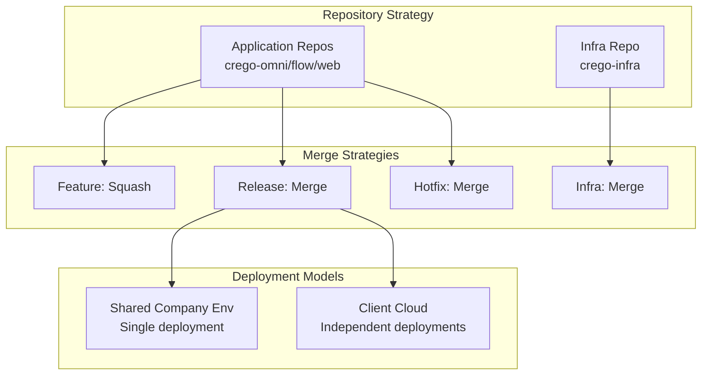
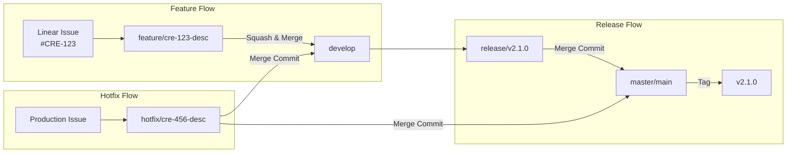
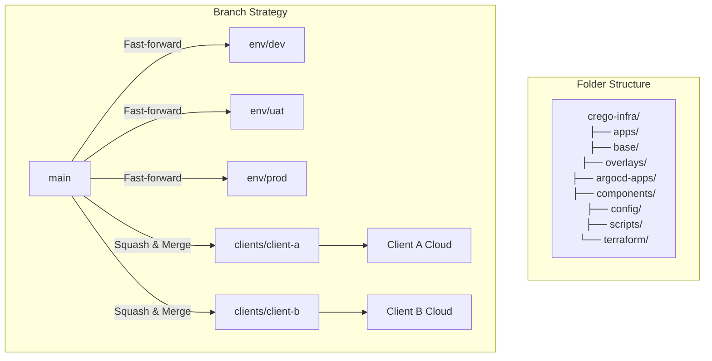

Author: Abhishek Sharma
Status: Draft
Category: PRD
Last edited time: January 8, 2026 6:23 PM
Summary: The guide outlines a branching and merge strategy for multi-tenant SaaS applications, detailing merge strategies for application and infrastructure repositories. Key strategies include "Squash & Merge" for features, "Merge Commit" for releases, and "Merge Commit" for hotfixes. A visual overview and repository-specific strategies are provided, along with a quick reference table for when to use each strategy, including branch protection settings to ensure code quality and approval processes.

## Multi-tenant SaaS with Mixed Deployment Models

---

## 📊 Visual Overview



---

## 🔀 Merge Strategy Matrix

### **Application Repositories** (crego-omni, crego-flow, crego-web)

| Branch Type | Merge Strategy | Why | When |
| --- | --- | --- | --- |
| **Feature** | `Squash & Merge` | Clean history, single commit per feature | Feature → develop |
| **Release** | `Merge Commit` | Preserve release timeline | Release → master/main |
| **Hotfix** | `Merge Commit` | Preserve hotfix context in history | Hotfix → master/main |
| **Develop** | `Merge Commit` | Preserve hotfix context when merging back | Hotfix → develop |

### **Infrastructure Repository** (crego-infra)

| Branch Type | Merge Strategy | Why |
| --- | --- | --- |
| **Environment** | `Merge Commit` | Track config changes clearly |
| **Client Branch** | `Squash & Merge` | Clean client-specific changes |
| **Main → Env** | `Fast-forward` | Propagate base templates |

---

## 🏗️ Repository-Specific Strategy

### **📁 Application Repos** (crego-omni, crego-flow, crego-web)



### **📁 Infrastructure Repo** (crego-infra)



## 📋 Quick Reference Table

### **When to Use Which Merge Strategy**

| Scenario | Repo Type | Strategy | Command | Result |
| --- | --- | --- | --- | --- |
| Feature complete | App | Squash | GitHub UI | Single commit in develop |
| Release ready | App | Merge | `--no-ff` | Release marker in history |
| Critical fix | App | Merge | `--no-ff` | Hotfix marker in master/main |
| Env update | Infra | Fast-forward | `--ff-only` | Clean propagation |
| Client config | Infra | Squash | `--squash` | Clean client changes |
| Base template | Infra | Merge | Standard | Track template evolution |

### **Branch Protection Settings**

```
Application Repos (master or main depending on repo):
- master/main: Require squash/merge, 2 approvals
- develop:     Allow squash/merge, 2 approvals
- release/*:   Allow merge commits, 2 approvals
- hotfix/*:    Allow merge commit, 2 approvals

Infrastructure Repo:
- main:        Require squash/merge, 2 approvals
- env/prod:    Require fast-forward only, SRE approval
- clients/*:   Allow squash/merge, client+lead approval
```

---

- [Deployment Models](deployment-models.md)
- [Complete Workflow with Merge Strategies](complete-workflow.md)
- [Practical Commands Guide](practical-commands.md)
- [Infrastructure Structure & Workflow](infrastructure-workflow.md)
- [Client Version Management](client-version-management.md)
- [Emergency Procedures](emergency-procedures.md)