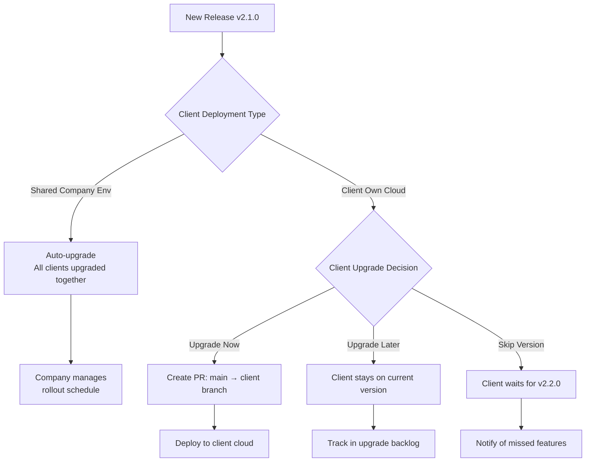

# Client Version Management

### **Version Matrix Example**

```
Client          | Deployment     | Current Ver   | Upgrade Policy
--------------- | -------------- | ------------- | -----------------------------
Client A        | Shared env     | v2.0.0        | Auto-upgrade (company managed)
Client B        | Shared env     | v2.0.0        | Auto-upgrade (company managed)
Client C        | Own AWS        | v1.9.0        | Manual (client controls timing)
Client D        | Own GCP        | v2.1.0        | Manual (stays current)
Client E        | Own Azure      | v1.8.0        | Manual (skips versions)

```

### **Client Decision Flow**


