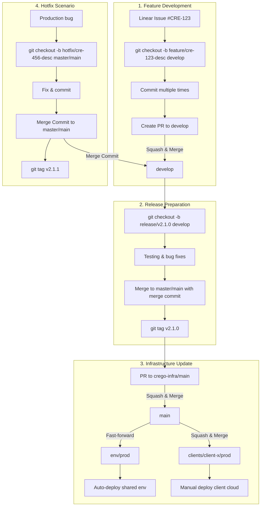

# Complete Workflow with Merge Strategies

```mermaid
graph TB
    subgraph "1. Feature Development"
        L[Linear Issue #CRE-123] --> FB[git checkout -b feature/cre-123-desc develop]
        FB --> Work[Commit multiple times]
        Work --> PR[Create PR to develop]
        PR -->|Squash & Merge| D[develop]
    end

    subgraph "2. Release Preparation"
        D --> RB[git checkout -b release/v2.1.0 develop]
        RB --> RT[Testing & bug fixes]
        RT --> RM[Merge to master/main with merge commit]
        RM --> Tag[git tag v2.1.0]
    end

    subgraph "3. Infrastructure Update"
        Tag --> InfraPR[PR to crego-infra/main]
        InfraPR -->|Squash & Merge| InfraM[main]

        InfraM -->|Fast-forward| Shared[env/prod]
        InfraM -->|Squash & Merge| ClientB[clients/client-x/prod]

        Shared --> DeployS[Auto-deploy shared env]
        ClientB --> DeployC[Manual deploy client cloud]
    end

    subgraph "4. Hotfix Scenario"
        Bug[Production bug] --> HB[git checkout -b hotfix/cre-456-desc master/main]
        HB --> Fix[Fix & commit]
        Fix --> HM[Merge Commit to master/main]
        HM --> HTag[git tag v2.1.1]
        HM -->|Merge Commit| D
    end

```