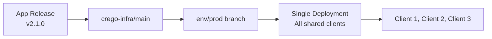
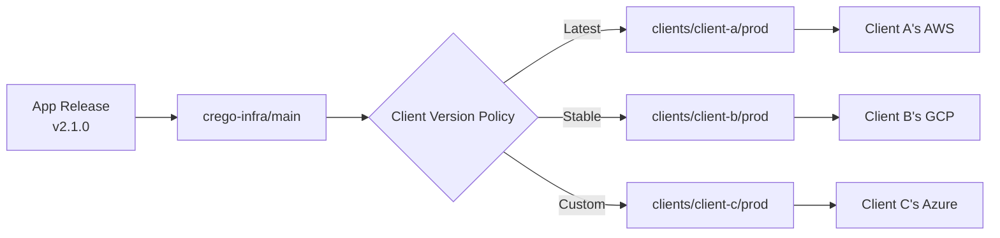

# Deployment Models

### **Model 1: Shared Company Environment**

**Characteristics:**

- Single deployment instance
- All clients share same infrastructure
- Database: Multi-tenancy with tenant_id
- Version: All clients same version

### **Model 2: Client Cloud Deployment**

**Characteristics:**

- Separate deployments per client
- Client controls infrastructure
- Database: Isolated per client
- Version: Can differ per client