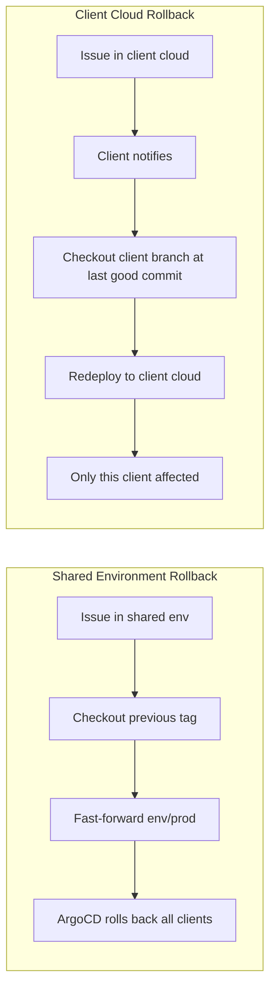

# Emergency Procedures

### **Rollback by Deployment Type**



### **Commands:**

```bash
# Shared env rollback
git checkout env/prod
git reset --hard v2.0.0
git push --force origin env/prod

# Client cloud rollback
git checkout clients/client-a/prod
git revert HEAD --no-edit  # Revert last deployment
git push origin clients/client-a/prod

```