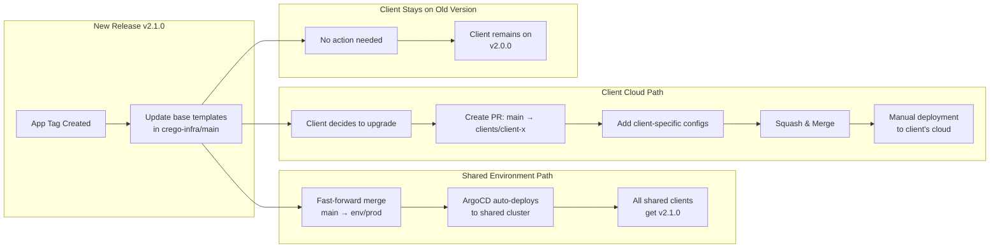

# Infrastructure Structure & Workflow

### **Directory Layout**

> **Note:** The actual directory layout of `crego-infra` is shown below. See `crego-infra/CLAUDE.md` for detailed structure guidance.

```
crego-infra/
├── apps/                    # Kubernetes app definitions
├── argocd-apps/             # ArgoCD application manifests
├── base/                    # Base K8s resources
├── components/              # Reusable Kustomize components
├── config/                  # Configuration files
├── overlays/                # Environment-cloud overlays (dev-gcp, prod-aws, etc.)
├── scripts/                 # Deployment and management scripts
└── terraform/               # Terraform modules

```

### **Update Flow for Mixed Deployment**


